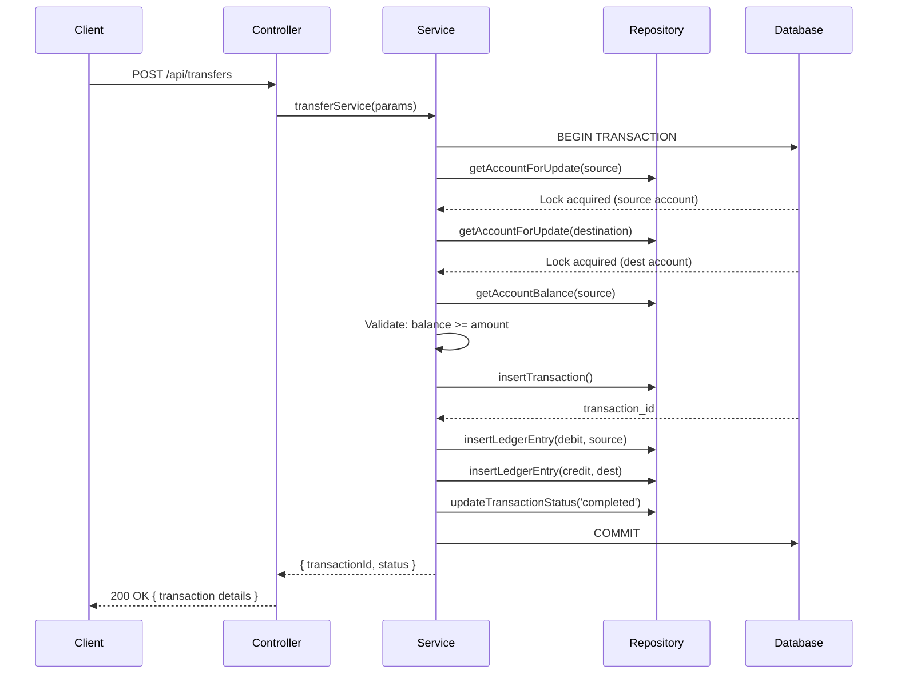
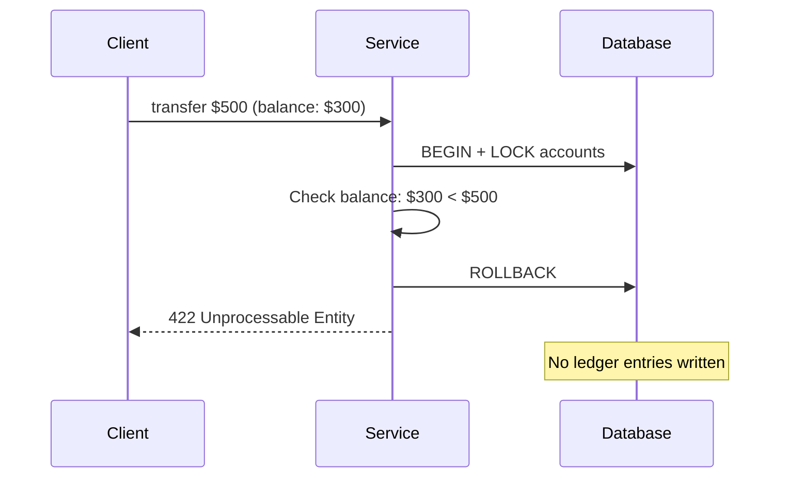

# Financial Ledger API with Double-Entry Bookkeeping

A production-ready REST API implementing a complete double-entry bookkeeping system with ACID-compliant financial transactions.

## Table of Contents
- [Features](#features)
- [Technology Stack](#technology-stack)
- [Setup Instructions](#setup-instructions)
- [Configuration](#configuration)
- [Running the Project](#running-the-project)
- [API Endpoints](#api-endpoints)
- [Design Decisions](#design-decisions)
- [Architecture](#architecture)
- [Database Schema](#database-schema)
- [Testing](#testing)

## Features

✅ **Double-Entry Bookkeeping**: Every transaction creates balanced debit and credit entries  
✅ **ACID Compliance**: Atomicity, Consistency, Isolation, Durability guaranteed  
✅ **Immutable Ledger**: Historical transactions cannot be modified or deleted  
✅ **Negative Balance Prevention**: All operations validated to prevent overdrafts  
✅ **Concurrency Safety**: Row-level locks prevent race conditions  
✅ **Accurate Balances**: Always computed from the sum of ledger entries  
✅ **Complete Audit Trail**: Full transaction history available via API  

## Technology Stack

- **Runtime**: Node.js 18+
- **Language**: TypeScript 5.x
- **Framework**: Express.js
- **Database**: MySQL 8.0+
- **Libraries**: 
  - `mysql2` - MySQL client with Promise support
  - `decimal.js` - Precise decimal arithmetic
  - `dotenv` - Environment configuration
  - `uuid` - UUID generation

## Setup Instructions

### Prerequisites
- Node.js 18+ and npm
- MySQL 8.0+
- Git

### 1. Clone the Repository
```bash
git clone https://github.com/saihemanth2006/Financial-Ledger-API-with-Double-Entry-Bookkeeping.git
cd Financial-Ledger-API-with-Double-Entry-Bookkeeping
```

### 2. Install Dependencies
```bash
npm install
```

### 3. Configure Database
Create a MySQL database and user:
```sql
CREATE DATABASE ledger_db CHARACTER SET utf8mb4 COLLATE utf8mb4_unicode_ci;
CREATE USER 'ledger_user'@'localhost' IDENTIFIED BY 'your_secure_password';
GRANT ALL PRIVILEGES ON ledger_db.* TO 'ledger_user'@'localhost';
FLUSH PRIVILEGES;
```

### 4. Run Migrations
```bash
mysql -u ledger_user -p ledger_db < migrations/001_create_schema.sql
```

This creates:
- `app_user` table
- `account` table with status and metadata
- `money_transaction` table for transaction records
- `ledger_entry` table (immutable, append-only)
- `account_balances` view for computed balances
- Immutability triggers to prevent ledger modifications
- System user and clearing account

## Configuration

Create a `.env` file in the root directory:

```env
# Database Configuration
DATABASE_HOST=localhost
DATABASE_PORT=3306
DATABASE_USER=ledger_user
DATABASE_PASSWORD=your_secure_password
DATABASE_NAME=ledger_db

# Server Configuration
PORT=3000
```

## Running the Project

### Development Mode (with hot reload)
```bash
npm run dev
```

### Build for Production
```bash
npm run build
```

### Production Mode
```bash
npm start
```

The server will start on `http://localhost:3000`.

## API Endpoints

### Account Management

**Create Account**
```http
POST /api/accounts
Content-Type: application/json

{
  "userId": "00000000-0000-0000-0000-000000000000",
  "accountType": "checking",
  "currency": "USD",
  "metadata": {
    "nickname": "Main Account"
  }
}
```

**Get Account Details**
```http
GET /api/accounts/:accountId
```

**Get Account Ledger (Transaction History)**
```http
GET /api/accounts/:accountId/ledger?limit=50&offset=0
```

### Financial Transactions

**Deposit**
```http
POST /api/deposits
Content-Type: application/json

{
  "destinationAccountId": "account-uuid",
  "amount": "1000.00",
  "currency": "USD",
  "description": "Initial deposit"
}
```

**Withdrawal**
```http
POST /api/withdrawals
Content-Type: application/json

{
  "sourceAccountId": "account-uuid",
  "amount": "250.00",
  "currency": "USD",
  "description": "ATM withdrawal"
}
```

**Transfer**
```http
POST /api/transfers
Content-Type: application/json

{
  "sourceAccountId": "source-uuid",
  "destinationAccountId": "dest-uuid",
  "amount": "150.00",
  "currency": "USD",
  "description": "Payment to friend"
}
```

## Design Decisions

### 1. Double-Entry Bookkeeping Implementation

**Core Principle**: Every financial transaction creates exactly two ledger entries with equal and opposite effects.

**Implementation Strategy**:
- **Ledger Entry Table**: Immutable append-only table storing all debits and credits
- **Entry Types**: `debit` (decreases balance) and `credit` (increases balance)
- **Atomic Pairing**: Both entries are written within a single database transaction
- **Transaction Linking**: Each pair shares a common `transaction_id` for audit trail

**Example - Transfer $100 from Account A to Account B**:
```
Ledger Entry 1: Debit Account A $100  (decreases A's balance)
Ledger Entry 2: Credit Account B $100 (increases B's balance)
Net effect: $0 (books always balance)
```

**Deposits and Withdrawals** use a system clearing account:
- Deposit: Debit system clearing, Credit user account
- Withdrawal: Debit user account, Credit system clearing

### 2. ACID Properties Strategy

#### Atomicity
- **Implementation**: All operations wrapped in `withTransaction()` helper
- **Mechanism**: MySQL transactions with explicit `BEGIN`, `COMMIT`, `ROLLBACK`
- **Guarantee**: Both ledger entries are written together or neither is written
- **Error Handling**: Any exception triggers automatic rollback

```typescript
// All operations use this pattern
await withTransaction(async (conn) => {
  // Lock accounts
  // Validate business rules
  // Insert transaction record
  // Insert debit entry
  // Insert credit entry
  // Update transaction status to 'completed'
  // If any step fails, entire transaction rolls back
});
```

#### Consistency
- **Validation**: All operations validate currency, account status, and business rules
- **Balance Checks**: Computed inside locked transactions to ensure accuracy
- **Decimal Precision**: `decimal.js` library prevents floating-point errors
- **Referential Integrity**: Foreign keys enforce data relationships

#### Isolation
- **Level Used**: `READ COMMITTED` (MySQL default)
- **Row Locks**: `SELECT ... FOR UPDATE` prevents dirty reads and lost updates
- **Canonical Ordering**: Accounts locked in sorted order to prevent deadlocks
- **Serialization**: Concurrent operations on same account execute sequentially

#### Durability
- **Database Engine**: InnoDB with transaction logs
- **Commit Behavior**: Transactions committed only after all writes succeed
- **Crash Recovery**: MySQL ensures committed transactions survive system failures

### 3. Transaction Isolation Level Rationale

**Choice**: `READ COMMITTED` with explicit row locking

**Why Not SERIALIZABLE?**
- Performance overhead too high for high-concurrency financial systems
- Not necessary when using explicit row locks

**Why Not READ UNCOMMITTED?**
- Allows dirty reads (seeing uncommitted changes from other transactions)
- Unacceptable for financial data integrity

**Why Not REPEATABLE READ?**
- MySQL default, but can still have phantom reads
- Gap locking can cause performance issues

**Why READ COMMITTED + SELECT FOR UPDATE?**
✅ **Prevents Dirty Reads**: Only see committed data  
✅ **Row-Level Locking**: Explicitly lock involved accounts  
✅ **No Gap Locks**: Better concurrency for non-range queries  
✅ **Deadlock Prevention**: Canonical lock ordering (sorted account IDs)  
✅ **Balance Accuracy**: Locks held until transaction commits  

**Implementation**:
```typescript
// Lock accounts in consistent order to prevent deadlocks
const accountsToLock = [sourceAccountId, destAccountId].sort();
const [acc1, acc2] = await Promise.all(
  accountsToLock.map(id => repo.getAccountForUpdate(conn, id))
);
```

### 4. Balance Calculations and Negative Balance Prevention

#### Balance Calculation

**Source of Truth**: The `ledger_entry` table (immutable)

**Formula**:
```
Balance = SUM(credits) - SUM(debits)
```

**Implementation**:
- **SQL View**: `account_balances` auto-computes from ledger entries
- **API Layer**: Queries view for current balance
- **Transaction Layer**: Computes balance with row locks for validation

**SQL View Definition**:
```sql
CREATE VIEW account_balances AS
SELECT 
  a.id AS account_id,
  a.currency,
  COALESCE(
    SUM(CASE 
      WHEN le.entry_type = 'credit' THEN le.amount 
      ELSE -le.amount 
    END), 
    0.0
  ) AS balance
FROM account a
LEFT JOIN ledger_entry le ON a.id = le.account_id
GROUP BY a.id, a.currency;
```

#### Negative Balance Prevention

**Multi-Layer Defense**:

1. **Pre-Transaction Validation**
   - Check account exists and is active
   - Verify currency match between accounts
   - Parse and validate amount (must be positive)

2. **In-Transaction Balance Check**
   ```typescript
   const balance = await repo.getAccountBalance(conn, sourceAccountId);
   const newBalance = balance.minus(amount);
   
   if (newBalance.isNegative()) {
     throw new ApiError('insufficient_funds', 422);
   }
   ```

3. **Row Locking**
   - `SELECT ... FOR UPDATE` locks account row
   - Prevents concurrent withdrawals from same account
   - Balance check and ledger insert happen atomically

4. **Decimal Precision**
   - `decimal.js` ensures accurate arithmetic
   - No floating-point rounding errors

**Race Condition Prevention**:
```typescript
// Transaction 1 and 2 both try to withdraw $100 from account with $150
// Transaction 1: Locks account, checks balance ($150), proceeds
// Transaction 2: Blocks at SELECT FOR UPDATE
// Transaction 1: Writes entries, commits (balance now $50)
// Transaction 2: Gets lock, checks balance ($50), fails validation
```

## Architecture

### Component Overview

```
┌─────────────────────────────────────────────────────────────┐
│                      REST API Layer                          │
│  (Express Routes + Controllers)                              │
│  - Account Controller                                        │
│  - Transaction Controller                                    │
│  - Deposit/Withdrawal Controller                             │
└────────────────┬────────────────────────────────────────────┘
                 │
                 ↓
┌─────────────────────────────────────────────────────────────┐
│                    Service Layer                             │
│  (Business Logic + Validation)                               │
│  - Transfer Service                                          │
│  - Deposit Service                                           │
│  - Withdrawal Service                                        │
└────────────────┬────────────────────────────────────────────┘
                 │
                 ↓
┌─────────────────────────────────────────────────────────────┐
│                  Repository Layer                            │
│  (Data Access + SQL Queries)                                 │
│  - Ledger Repository                                         │
│  - Account Repository                                        │
└────────────────┬────────────────────────────────────────────┘
                 │
                 ↓
┌─────────────────────────────────────────────────────────────┐
│                   Database Layer                             │
│  (MySQL with InnoDB)                                         │
│  - app_user                                                  │
│  - account                                                   │
│  - money_transaction                                         │
│  - ledger_entry (immutable)                                  │
│  - account_balances (view)                                   │
└─────────────────────────────────────────────────────────────┘
```

### Transfer Transaction Flow



**Error Path** (Insufficient Funds):


## Database Schema

### Entity Relationship Diagram

```
┌──────────────────┐
│    app_user      │
│──────────────────│
│ id (PK)          │◄─────────┐
│ name             │          │
│ email (UNIQUE)   │          │
│ created_at       │          │
└──────────────────┘          │
                              │
                              │ user_id (FK)
                              │
┌──────────────────────────────┴─────┐
│           account                  │
│────────────────────────────────────│
│ id (PK)                            │◄──────────────┐
│ user_id (FK) → app_user.id         │               │
│ account_type (checking/savings)    │               │
│ currency (USD/EUR/etc)             │               │
│ status (active/frozen/closed)      │               │
│ metadata (JSON)                    │               │
│ created_at                         │               │
└────────────────────────────────────┘               │
         ▲                                           │
         │                                           │
         │ account_id (FK)                           │
         │                                           │
┌────────┴────────────────────┐                     │
│   money_transaction         │                     │
│─────────────────────────────│                     │
│ id (PK)                     │◄──────────┐         │
│ transaction_type            │           │         │
│ source_account_id (FK)      │           │         │
│ destination_account_id (FK) │           │         │
│ amount                      │           │         │
│ currency                    │           │         │
│ description                 │           │         │
│ status (pending/completed)  │           │         │
│ created_at                  │           │         │
│ completed_at                │           │         │
└─────────────────────────────┘           │         │
                                          │         │
                              transaction_id (FK)   │
                                          │         │
┌─────────────────────────────────────────┴─────────┴──┐
│              ledger_entry (IMMUTABLE)                 │
│───────────────────────────────────────────────────────│
│ id (PK)                                               │
│ transaction_id (FK) → money_transaction.id            │
│ account_id (FK) → account.id                          │
│ entry_type (debit/credit)                             │
│ amount (DECIMAL 24,8)                                 │
│ currency                                              │
│ note                                                  │
│ created_at                                            │
│ ──────────────────────────────────                    │
│ TRIGGERS:                                             │
│  - BEFORE UPDATE: SIGNAL error (immutable)            │
│  - BEFORE DELETE: SIGNAL error (immutable)            │
└───────────────────────────────────────────────────────┘
         │
         │ (aggregated by)
         ↓
┌─────────────────────────────┐
│   account_balances (VIEW)   │
│─────────────────────────────│
│ account_id                  │
│ currency                    │
│ balance (computed)          │
│   = SUM(credits) - SUM(debits)
└─────────────────────────────┘
```

### Key Constraints

**Primary Keys**:
- All tables use UUID v4 for distributed system compatibility

**Foreign Keys**:
- `account.user_id` → `app_user.id` (CASCADE DELETE)
- `money_transaction.source_account_id` → `account.id`
- `money_transaction.destination_account_id` → `account.id`
- `ledger_entry.transaction_id` → `money_transaction.id`
- `ledger_entry.account_id` → `account.id`

**Indexes**:
- `ledger_entry(transaction_id)` - Fast transaction lookup
- `ledger_entry(account_id, created_at)` - Fast history queries
- `account(user_id)` - Fast user account lookup
- `app_user(email)` - Unique constraint + fast lookup

**Immutability Enforcement**:
```sql
-- Prevent updates
CREATE TRIGGER ledger_entry_no_update 
BEFORE UPDATE ON ledger_entry 
FOR EACH ROW 
SIGNAL SQLSTATE '45000' 
SET MESSAGE_TEXT = 'ledger_entry is immutable';

-- Prevent deletes
CREATE TRIGGER ledger_entry_no_delete 
BEFORE DELETE ON ledger_entry 
FOR EACH ROW 
SIGNAL SQLSTATE '45000' 
SET MESSAGE_TEXT = 'ledger_entry is immutable';
```

## Testing

### Quick Test Suite (PowerShell)

```powershell
# 1. Create two accounts
$acc1 = Invoke-RestMethod -Uri 'http://localhost:3000/api/accounts' -Method Post -ContentType 'application/json' -Body '{"userId":"00000000-0000-0000-0000-000000000000","accountType":"checking","currency":"USD","metadata":{"nickname":"A1"}}'
$acc2 = Invoke-RestMethod -Uri 'http://localhost:3000/api/accounts' -Method Post -ContentType 'application/json' -Body '{"userId":"00000000-0000-0000-0000-000000000000","accountType":"checking","currency":"USD","metadata":{"nickname":"A2"}}'

# 2. Deposit $1000 to A1
Invoke-RestMethod -Uri "http://localhost:3000/api/deposits" -Method Post -ContentType "application/json" -Body (@{
    destinationAccountId = $acc1.id
    amount = "1000.00"
    currency = "USD"
    description = "Initial deposit"
} | ConvertTo-Json)

# 3. Transfer $150 from A1 to A2
Invoke-RestMethod -Uri "http://localhost:3000/api/transfers" -Method Post -ContentType "application/json" -Body (@{
    sourceAccountId = $acc1.id
    destinationAccountId = $acc2.id
    amount = "150.00"
    currency = "USD"
    description = "Test transfer"
} | ConvertTo-Json)

# 4. Check balances
Invoke-RestMethod -Uri "http://localhost:3000/api/accounts/$($acc1.id)" -Method Get
Invoke-RestMethod -Uri "http://localhost:3000/api/accounts/$($acc2.id)" -Method Get

# 5. View transaction history
Invoke-RestMethod -Uri "http://localhost:3000/api/accounts/$($acc1.id)/ledger?limit=50" -Method Get
```

### Validation Checks

**Double-Entry Verification**:
```sql
-- Every transaction should have exactly 2 entries with net = 0
SELECT 
  transaction_id, 
  COUNT(*) as entries, 
  SUM(CASE WHEN entry_type='credit' THEN amount ELSE -amount END) as net
FROM ledger_entry 
GROUP BY transaction_id 
HAVING entries != 2 OR net != 0;
-- Should return empty result
```

**Balance Consistency**:
```sql
-- API balance should match ledger sum
SELECT 
  ab.account_id,
  ab.balance as view_balance,
  COALESCE(SUM(CASE WHEN le.entry_type='credit' THEN le.amount ELSE -le.amount END), 0) as computed_balance
FROM account_balances ab
LEFT JOIN ledger_entry le ON ab.account_id = le.account_id
GROUP BY ab.account_id, ab.balance
HAVING ABS(view_balance - computed_balance) > 0.00000001;
-- Should return empty result
```

**Immutability Check**:
```sql
-- Try to modify ledger (should fail)
UPDATE ledger_entry SET amount = 999 WHERE id = (SELECT id FROM ledger_entry LIMIT 1);
-- Error: ledger_entry is immutable
```

### Postman Collection

Import this JSON into Postman:

```json
{
  "info": {
    "name": "Financial Ledger API",
    "schema": "https://schema.getpostman.com/json/collection/v2.1.0/collection.json"
  },
  "item": [
    {
      "name": "Create Account",
      "request": {
        "method": "POST",
        "header": [{"key": "Content-Type", "value": "application/json"}],
        "body": {
          "mode": "raw",
          "raw": "{\n  \"userId\": \"00000000-0000-0000-0000-000000000000\",\n  \"accountType\": \"checking\",\n  \"currency\": \"USD\",\n  \"metadata\": {\n    \"nickname\": \"Main Account\"\n  }\n}"
        },
        "url": {"raw": "http://localhost:3000/api/accounts", "protocol": "http", "host": ["localhost"], "port": "3000", "path": ["api", "accounts"]}
      }
    },
    {
      "name": "Get Account",
      "request": {
        "method": "GET",
        "url": {"raw": "http://localhost:3000/api/accounts/{{accountId}}", "protocol": "http", "host": ["localhost"], "port": "3000", "path": ["api", "accounts", "{{accountId}}"]}
      }
    },
    {
      "name": "Deposit",
      "request": {
        "method": "POST",
        "header": [{"key": "Content-Type", "value": "application/json"}],
        "body": {
          "mode": "raw",
          "raw": "{\n  \"destinationAccountId\": \"{{accountId}}\",\n  \"amount\": \"1000.00\",\n  \"currency\": \"USD\",\n  \"description\": \"Initial deposit\"\n}"
        },
        "url": {"raw": "http://localhost:3000/api/deposits", "protocol": "http", "host": ["localhost"], "port": "3000", "path": ["api", "deposits"]}
      }
    },
    {
      "name": "Withdrawal",
      "request": {
        "method": "POST",
        "header": [{"key": "Content-Type", "value": "application/json"}],
        "body": {
          "mode": "raw",
          "raw": "{\n  \"sourceAccountId\": \"{{accountId}}\",\n  \"amount\": \"250.00\",\n  \"currency\": \"USD\",\n  \"description\": \"ATM withdrawal\"\n}"
        },
        "url": {"raw": "http://localhost:3000/api/withdrawals", "protocol": "http", "host": ["localhost"], "port": "3000", "path": ["api", "withdrawals"]}
      }
    },
    {
      "name": "Transfer",
      "request": {
        "method": "POST",
        "header": [{"key": "Content-Type", "value": "application/json"}],
        "body": {
          "mode": "raw",
          "raw": "{\n  \"sourceAccountId\": \"{{sourceAccountId}}\",\n  \"destinationAccountId\": \"{{destinationAccountId}}\",\n  \"amount\": \"150.00\",\n  \"currency\": \"USD\",\n  \"description\": \"Payment\"\n}"
        },
        "url": {"raw": "http://localhost:3000/api/transfers", "protocol": "http", "host": ["localhost"], "port": "3000", "path": ["api", "transfers"]}
      }
    },
    {
      "name": "Get Ledger",
      "request": {
        "method": "GET",
        "url": {"raw": "http://localhost:3000/api/accounts/{{accountId}}/ledger?limit=50&offset=0", "protocol": "http", "host": ["localhost"], "port": "3000", "path": ["api", "accounts", "{{accountId}}", "ledger"], "query": [{"key": "limit", "value": "50"}, {"key": "offset", "value": "0"}]}
      }
    }
  ],
  "variable": [
    {"key": "accountId", "value": ""},
    {"key": "sourceAccountId", "value": ""},
    {"key": "destinationAccountId", "value": ""}
  ]
}
```

## Contributing

1. Fork the repository
2. Create a feature branch (`git checkout -b feature/amazing-feature`)
3. Commit your changes (`git commit -m 'Add amazing feature'`)
4. Push to the branch (`git push origin feature/amazing-feature`)
5. Open a Pull Request

## License

MIT License - see LICENSE file for details

## Contact

Sai Hemanth - [GitHub](https://github.com/saihemanth2006)

Project Link: [https://github.com/saihemanth2006/Financial-Ledger-API-with-Double-Entry-Bookkeeping](https://github.com/saihemanth2006/Financial-Ledger-API-with-Double-Entry-Bookkeeping)
